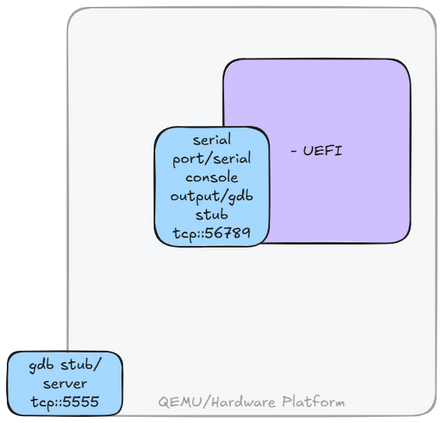
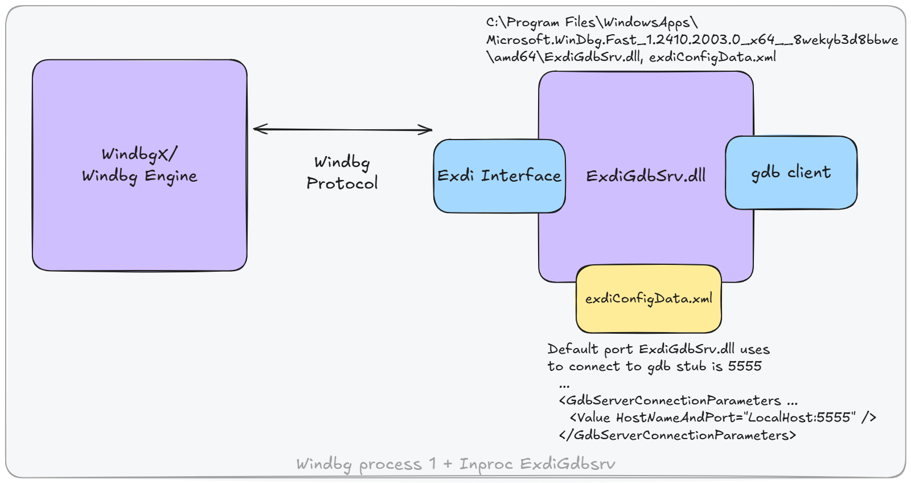
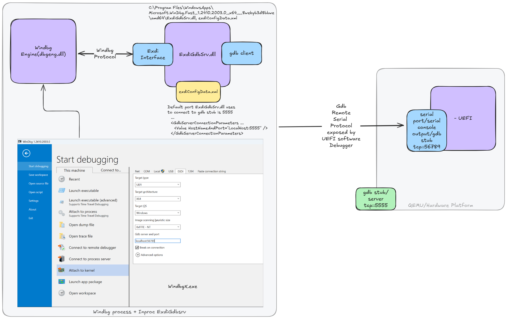
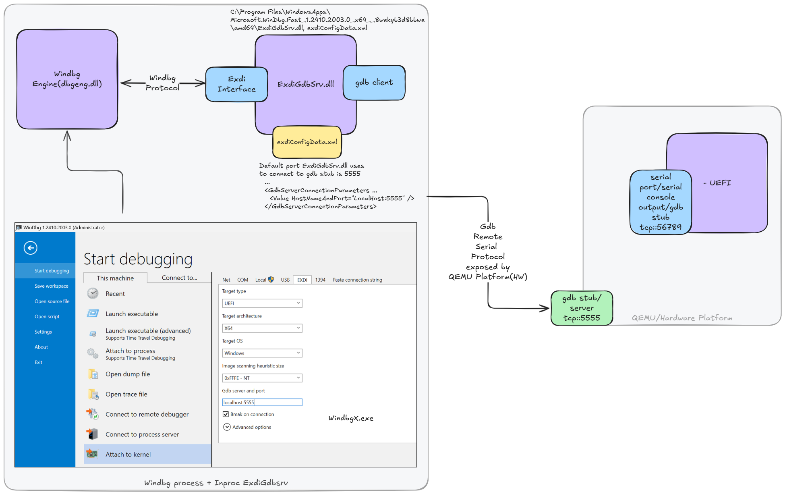
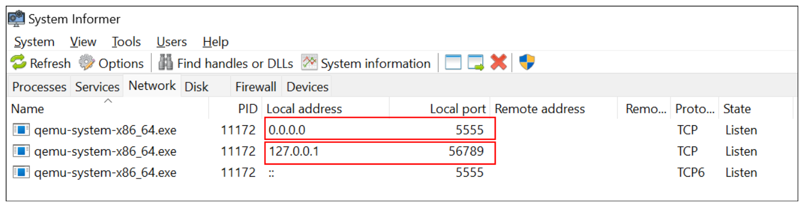
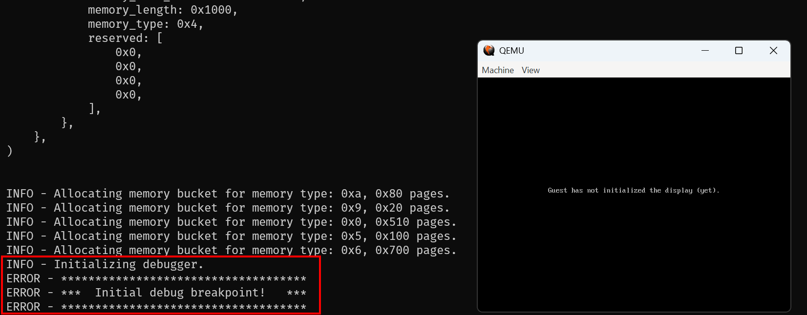
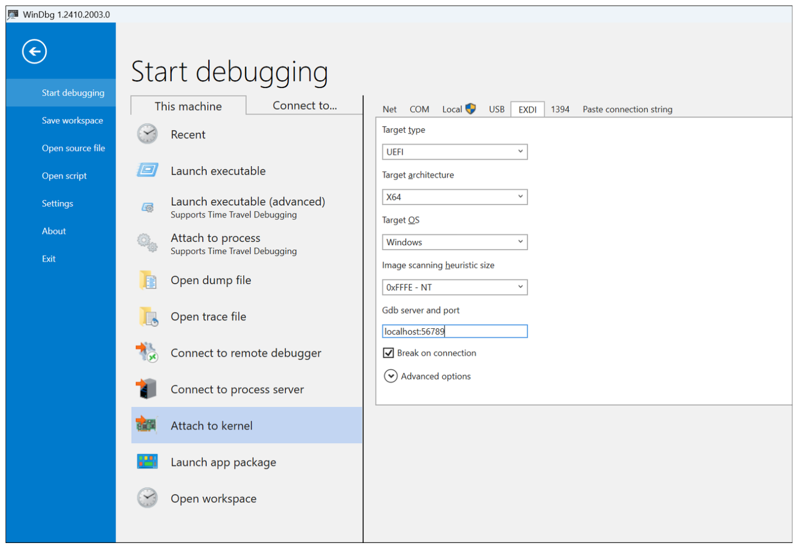
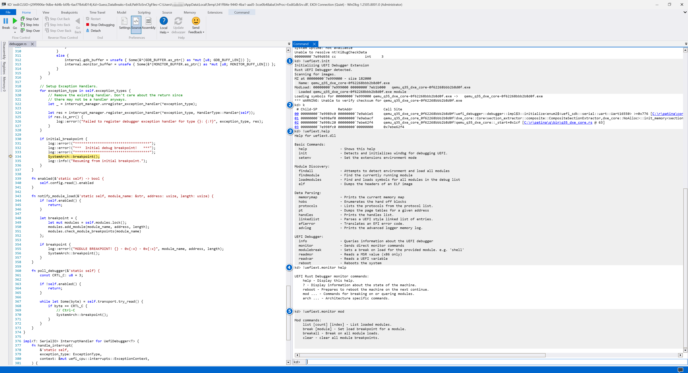
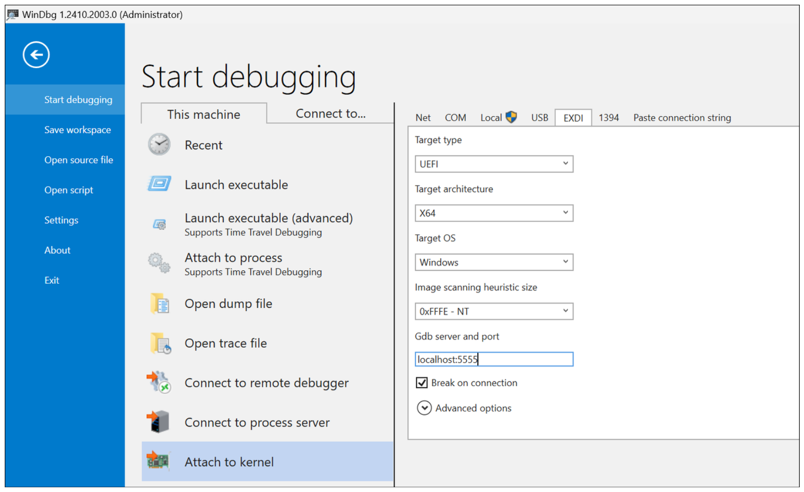

# 🐞 WinDbg + QEMU + Patina UEFI - Debugging Guide

## Overview

QEMU can expose two serial ports: one for **software debugging** and another for **hardware debugging**.

- **Software Debugging Serial Port**
  Used for communicating with the UEFI SW debugger.

- **Hardware Debugging Serial Port**
  Used for low-level QEMU hardware debugging.

Each serial port can be used independently or simultaneously. Both expose the
[GDB Remote Serial Protocol](https://ftp.gnu.org/old-gnu/Manuals/gdb/html_node/gdb_125.html).



[WinDbg](https://learn.microsoft.com/en-us/windows-hardware/drivers/debuggercmds/windbg-overview) communicates with
QEMU using the
[EXDi Interface](https://learn.microsoft.com/en-us/windows-hardware/drivers/debugger/configuring-the-exdi-debugger-transport).
The EXDi interface allows WinDbg to interact with transports like the GDB Remote Serial Protocol that QEMU provides.

The `ExdiGdbSrv.dll` in WinDbg acts as a GDB client.



---

### End-to-End Communication Flow

#### Software Debugging: WinDbg ↔ EXDi ↔ GDB Stub ↔ Serial Port ↔ UEFI Debugger



#### Hardware Debugging: WinDbg ↔ EXDi ↔ GDB Stub ↔ Serial Port ↔ QEMU HW



---

## Setting Up WinDbg

- Download and install [WinDbg](https://learn.microsoft.com/windows-hardware/drivers/debugger/).
- Verify that `ExdiGdbSrv.dll` and `exdiConfigData.xml` were installed into the
  `C:\Program Files\WindowsApps\Microsoft.WinDbg.Fast_1.xxxxxxxxx\amd64` directory.
- Download the latest release of the UEFI WinDbg Extension from
  [uefi_debug_tools releases](https://github.com/microsoft/uefi_debug_tools/releases/latest).
- Extract its contents to `%LOCALAPPDATA%\Dbg\EngineExtensions\`.

---

## Launching Patina QEMU UEFI with Debugging Enabled

The `patina-qemu` UEFI platform build, by default, uses a pre-compiled DXE Core binary from a NuGet feed provided by
the [`patina-dxe-core-qemu`](https://github.com/OpenDevicePartnership/patina-dxe-core-qemu) repository. Since these
binaries have debug disabled, the following steps enable debug and override the default.

> **Note:** The following steps are for the Q35 build, but the same can be done for the SBSA build. They use the build
> command-line parameter `BLD_*_DXE_CORE_BINARY_OVERRIDE` to override the current DXE Core with the new file. For
> other options such as patching a UEFI FD binary, see the
> [Rapid Patina Iteration](../building/rapid_iteration.md) page.

- Clone the Patina DXE Core QEMU repository into a new directory.
- Build it:
  - Debug build (debugger included): `cargo make q35`
  - Release build: `cargo make q35-release --features build_debugger`
- The output file will be: `/target/x86_64-unknown-uefi/debug/qemu_q35_dxe_core.efi`
  > The output `.efi` file contains only the `.pdb` file name, not the full path. When using WinDbg, set the path to
  > the directory containing the `.pdb` file appropriately (as described in [Software Debugging](#instance-1-software-debugging)).

- Return to this repository's directory and rebuild the `patina-qemu` UEFI using the `BLD_*_DXE_CORE_BINARY_OVERRIDE`
  command-line parameter to indicate which override DXE Core driver to use:

  ```cmd
  stuart_build -c Platforms/QemuQ35Pkg/PlatformBuild.py GDB_SERVER=5555 SERIAL_PORT=56789 --FlashRom BLD_*_DXE_CORE_BINARY_OVERRIDE="<patina dxe core qemu repo path>/target/x86_64-unknown-uefi/debug/qemu_q35_dxe_core.efi"
  ```

- The `stuart_build` command will also launch QEMU and wait for the initial break-in:

  

  

---

## Launching WinDbg Instances

### Instance 1: Software Debugging

1. Launch **WinDbg**. This will connect to the QEMU SW serial port (`56789`).

   

2. Set symbol and source paths:

   ```cmd
   .sympath+ <path to pdb dir> ; usually <cloned dir>\target\x86_64-unknown-uefi\debug\deps
   .srcpath+ <path to src dir> ; usually <cloned dir>\src
   ```

    > You can avoid setting this for every debug session by configuring the `_NT_SYMBOL_PATH` environment variable, for
    > example:
    >
    > `C:\repos\patina-dxe-core-qemu\target\x86_64-unknown-uefi\debug;C:\repos\patina-dxe-core-qemu\target\aarch64-unknown-uefi\debug;srv*c:\symbolspri*https://symweb.azurefd.net;srv*C:\Symbols*https://msdl.microsoft.com/download/symbols`

3. Initialize the UEFI debugger extension:

   ```cmd
   !uefiext.init
   ```

4. `!uefiext.help` lists all available commands.

   

---

### Instance 2: Hardware Debugging (Optional)

1. Launch another **WinDbg** instance.

   

2. It should automatically connect to the QEMU HW serial port (`5555`).
