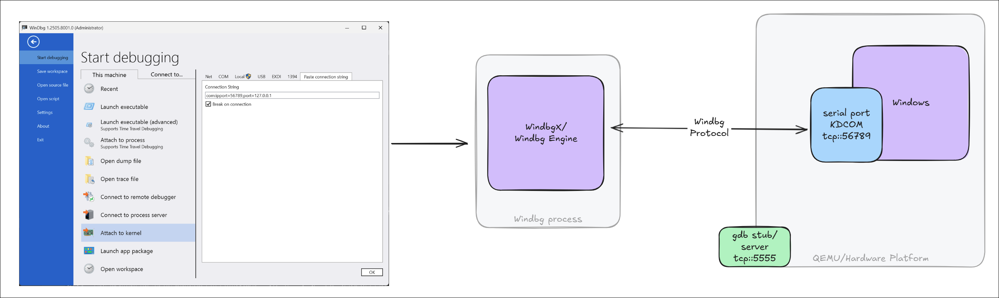
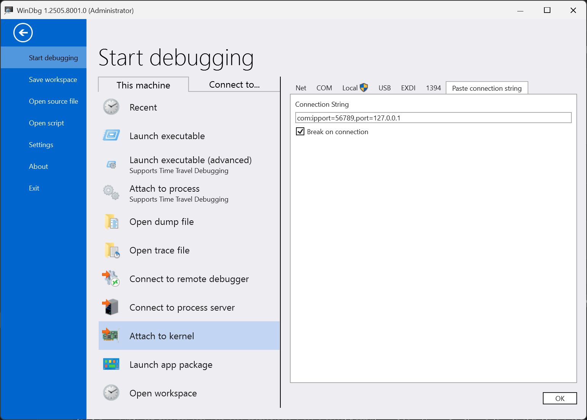
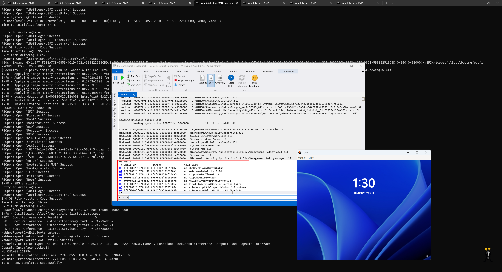

# 🐞 WinDbg + QEMU + Patina UEFI + 🪟 Windows OS - Debugging Guide

In addition to the steps discussed in [WinDbg + QEMU + Patina UEFI Debugging](windbg_uefi.md), this document describes
how to launch Windows and perform kernel debugging on QEMU. Unlike the UEFI software debugger and the QEMU hardware
debugger, Windows does not require EXDi — it natively communicates with WinDbg using the KDCOM transport.



## Prepare the OS Image

1. Download the original OS image in either VHDX or QCOW2 format. If the image has never been booted before, use
   Hyper-V to boot it once and complete the OOBE (Out-of-Box Experience) process if any. Recommended references:

   - [Enable Hyper-V on Windows 11](https://learn.microsoft.com/en-us/windows-server/virtualization/hyper-v/get-started/Install-Hyper-V)
   - [Create a Virtual Machine with Hyper-V](https://learn.microsoft.com/en-us/windows-server/virtualization/hyper-v/get-started/create-a-virtual-machine-in-hyper-v)

2. Although QEMU supports both VHDX and QCOW2 formats, using a QCOW2 image is recommended for reliability. Convert
   VHDX to QCOW2 with:

   ```sh
   qemu-img convert -f vhdx -p -c -O qcow2 Windows11.vhdx Windows11.qcow2
   ```

   > `qemu-img.exe` is present in the QEMU installation path (`C:\Program Files\qemu`).

## Launch QEMU with Patina UEFI and Windows

By default, the `patina-qemu` build uses a pre-compiled Patina DXE Core binary, which is sufficient to boot and debug
Windows as outlined here. If debugging of the Patina UEFI or any other UEFI driver is needed, see the
[WinDbg + QEMU + Patina UEFI - Debugging Guide](windbg_uefi.md).

To compile the firmware image and launch QEMU with serial and GDB support:

```sh
stuart_build -c Platforms/QemuQ35Pkg/PlatformBuild.py GDB_SERVER=5555 SERIAL_PORT=56789 --FlashRom PATH_TO_OS="C:\Windows11.qcow2"
```

> Key parameter: `PATH_TO_OS="C:\Windows11.qcow2"`.

## Enable Kernel Debugging on the QEMU Guest (Windows)

After booting to the Windows desktop, open a Command Prompt and run the following commands to enable kernel and boot
debugging (boot debugging is optional):

```cmd
bcdedit /dbgsettings serial debugport:1 baudrate:115200
bcdedit /set {default} debug on
bcdedit /set {default} bootdebug on
shutdown -r -t 0   :: reboot for the above settings to take effect
```

## Launch WinDbg for Kernel Debugging

Once Windows reboots, run the following to connect WinDbg:

```sh
windbgx -k com:ipport=56789,port=127.0.0.1 -v
```

Or via UI:



> Replace `56789` with the serial port used during QEMU launch.



## Serial Console for UEFI

Use a terminal application such as PuTTY or Tera Term to connect to the `<port number>` you configured for QEMU,
using the Raw TCP/IP protocol to `127.0.0.1`.

**Notes:**

- You must release this console for the kernel debugger to attach.
- Some terminal applications enable "local line editing" by default on raw connections. Turn this off to avoid sending
  garbage keystrokes.
